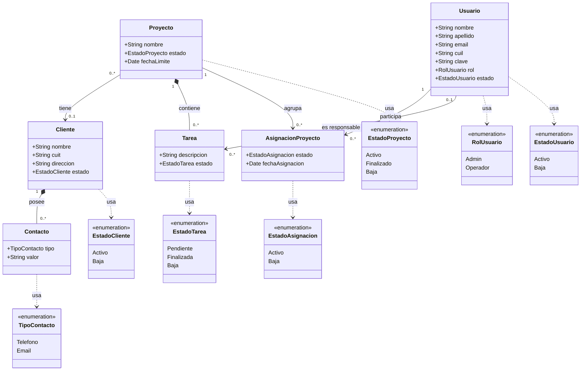

# Diagrama de Clases
**Sistema:** Gestión de Proyectos  
**Materia:** Ingeniería de Software — UNER  
**Notación:** UML — Mermaid (compatible draw.io)

---

## Importar en draw.io

1. Abrir draw.io → `Extras > Edit Diagram`
2. En el desplegable superior seleccionar **Mermaid**
3. Borrar el contenido existente y pegar el bloque de código de abajo
4. Click en **OK**

---

---

## Descripción de Relaciones

| Relación | Tipo | Cardinalidad | Descripción |
|----------|------|--------------|-------------|
| Proyecto → Cliente | Asociación | 0..* a 0..1 | Un proyecto puede tener un cliente o ninguno. Un cliente puede estar en varios proyectos. |
| Proyecto → Tarea | Composición | 1 a 0..* | Las tareas pertenecen a un proyecto. Si el proyecto se elimina, sus tareas también. |
| Cliente → Contacto | Composición | 1 a 0..* | Los contactos pertenecen a un cliente. Si el cliente se elimina, sus contactos también. |
| Usuario → AsignacionProyecto | Asociación | 1 a 0..* | Un usuario puede tener múltiples asignaciones a distintos proyectos. |
| Proyecto → AsignacionProyecto | Asociación | 1 a 0..* | Un proyecto puede tener múltiples usuarios asignados. Si el proyecto se elimina, sus asignaciones también. |

---

## Notas de diseño

- `Cliente` en estado `Baja` no puede ser asignado a nuevos proyectos (R01).
- `Cliente` solo puede pasar a estado `Baja` si no tiene proyectos asociados (R02).
- La relación `Proyecto → Cliente` es opcional: un proyecto puede ser interno (sin cliente).
- `Usuario` tiene un `rol` que determina sus permisos: Admin puede gestionar usuarios y dar de baja proyectos/tareas (R05, R06).
- `Proyecto` tiene `fechaLimite` opcional. Se considera retrasado si la fecha límite es anterior a la fecha actual y el estado no es Finalizado (R08).
- `Contacto` es una entidad dependiente de `Cliente`, puede ser de tipo Telefono o Email, con cardinalidad 0..*.
- `AsignacionProyecto` es una clase de asociación entre `Usuario` y `Proyecto`. Registra el estado (Activo/Baja) y la fecha de asignación. Un usuario solo puede tener una asignación activa por proyecto (R09). Si se elimina el proyecto, sus asignaciones se eliminan en cascada.
- `Usuario` tiene los campos `apellido`, `email` (único) y `cuil` (único) como opcionales. El login se realiza con `email` + `clave`.
- `Cliente` tiene `cuit` (único, opcional) y `direccion` (opcional) además de `nombre` y `estado`.
- `Tarea` tiene un `responsable` opcional (FK `usuario_id`). Una tarea puede existir sin responsable asignado. Si el usuario se da de baja, el campo queda en null (SET NULL). La asignación no implica propiedad ni restricción de visibilidad (R03, R04).
