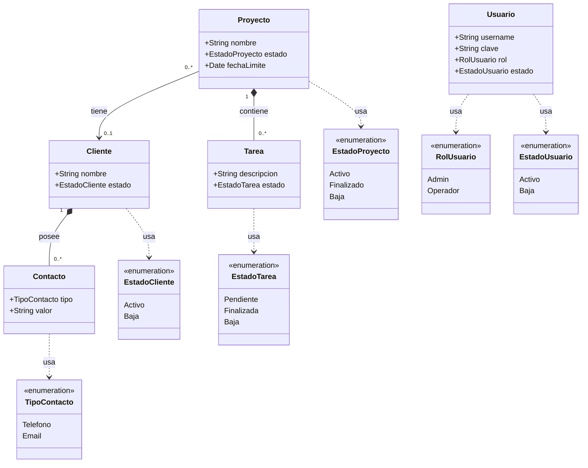

# Diagrama de Clases
**Sistema:** Gestión de Proyectos  
**Materia:** Ingeniería de Software — UNER  
**Notación:** UML — Mermaid (compatible draw.io)

---

## Importar en draw.io

1. Abrir draw.io → `Extras > Edit Diagram`
2. En el desplegable superior seleccionar **Mermaid**
3. Borrar el contenido existente y pegar el bloque de código de abajo
4. Click en **OK**

---

---

## Descripción de Relaciones

| Relación | Tipo | Cardinalidad | Descripción |
|----------|------|--------------|-------------|
| Proyecto → Cliente | Asociación | 0..* a 0..1 | Un proyecto puede tener un cliente o ninguno. Un cliente puede estar en varios proyectos. |
| Proyecto → Tarea | Composición | 1 a 0..* | Las tareas pertenecen a un proyecto. Si el proyecto se elimina, sus tareas también. |
| Cliente → Contacto | Composición | 1 a 0..* | Los contactos pertenecen a un cliente. Si el cliente se elimina, sus contactos también. |
| Usuario | Independiente | — | Los usuarios no tienen relación de propiedad con ninguna entidad (restricción R04). |

---

## Notas de diseño

- `Cliente` en estado `Baja` no puede ser asignado a nuevos proyectos (R01).
- `Cliente` solo puede pasar a estado `Baja` si no tiene proyectos asociados (R02).
- La relación `Proyecto → Cliente` es opcional: un proyecto puede ser interno (sin cliente).
- `Usuario` tiene un `rol` que determina sus permisos: Admin puede gestionar usuarios y dar de baja proyectos/tareas (R05, R06).
- `Proyecto` tiene `fechaLimite` opcional. Se considera retrasado si la fecha límite es anterior a la fecha actual y el estado no es Finalizado (R08).
- `Contacto` es una entidad dependiente de `Cliente`, puede ser de tipo Telefono o Email, con cardinalidad 0..*.
