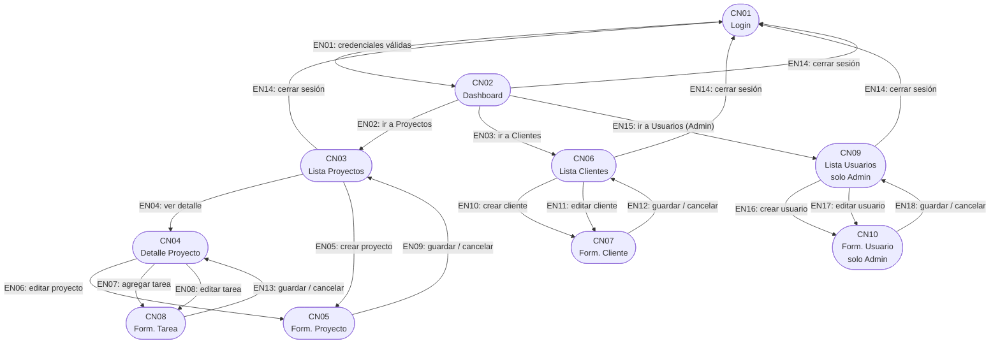

# Modelo Navegacional — Enlaces Navegacionales
**Sistema:** Gestión de Proyectos  
**Materia:** Ingeniería de Software — UNER  
**Metodología:** OOWS

---

## Enlaces Navegacionales

Un enlace navegacional define la transición entre dos contextos. Puede ser activado por una acción del usuario o por una condición del sistema.

### Base

| ID    | Origen                  | Destino                 | Activador                              | Condición                                      |
|-------|-------------------------|-------------------------|----------------------------------------|------------------------------------------------|
| EN01  | CN01 - Login            | CN02 - Dashboard        | Envío de credenciales                  | Usuario existe y está en estado "Activo"        |
| EN02  | CN02 - Dashboard        | CN03 - Lista Proyectos  | Clic en "Proyectos"                    | Usuario autenticado                            |
| EN03  | CN02 - Dashboard        | CN06 - Lista Clientes   | Clic en "Clientes"                     | Usuario autenticado                            |
| EN04  | CN03 - Lista Proyectos  | CN04 - Detalle Proyecto | Clic en un proyecto                    | Proyecto seleccionado existe                   |
| EN05  | CN03 - Lista Proyectos  | CN05 - Form. Proyecto   | Clic en "Crear proyecto"               | Usuario autenticado                            |
| EN06  | CN04 - Detalle Proyecto | CN05 - Form. Proyecto   | Clic en "Editar proyecto"              | Proyecto en estado "Activo"                    |
| EN07  | CN04 - Detalle Proyecto | CN08 - Form. Tarea      | Clic en "Agregar tarea"                | Proyecto existe                                |
| EN08  | CN04 - Detalle Proyecto | CN08 - Form. Tarea      | Clic en "Editar tarea"                 | Tarea seleccionada existe                      |
| EN09  | CN05 - Form. Proyecto   | CN03 - Lista Proyectos  | Guardar exitoso / Cancelar             | —                                              |
| EN10  | CN06 - Lista Clientes   | CN07 - Form. Cliente    | Clic en "Crear cliente"                | Usuario autenticado                            |
| EN11  | CN06 - Lista Clientes   | CN07 - Form. Cliente    | Clic en "Editar cliente"               | Cliente seleccionado existe                    |
| EN12  | CN07 - Form. Cliente    | CN06 - Lista Clientes   | Guardar exitoso / Cancelar             | —                                              |
| EN13  | CN08 - Form. Tarea      | CN04 - Detalle Proyecto | Guardar exitoso / Cancelar             | —                                              |
| EN14  | Cualquier contexto      | CN01 - Login            | Clic en "Cerrar sesión"                | Usuario autenticado                            |

### E01 — Gestión de usuarios y roles

| ID    | Origen                  | Destino                 | Activador                              | Condición                                      |
|-------|-------------------------|-------------------------|----------------------------------------|------------------------------------------------|
| EN15  | CN02 - Dashboard        | CN09 - Lista Usuarios   | Clic en "Usuarios"                     | Usuario autenticado con rol Admin              |
| EN16  | CN09 - Lista Usuarios   | CN10 - Form. Usuario    | Clic en "Crear usuario"                | Usuario autenticado con rol Admin              |
| EN17  | CN09 - Lista Usuarios   | CN10 - Form. Usuario    | Clic en "Editar usuario"               | Usuario seleccionado existe                    |
| EN18  | CN10 - Form. Usuario    | CN09 - Lista Usuarios   | Guardar exitoso / Cancelar             | —                                              |

---

## Diagrama de Flujo Navegacional

